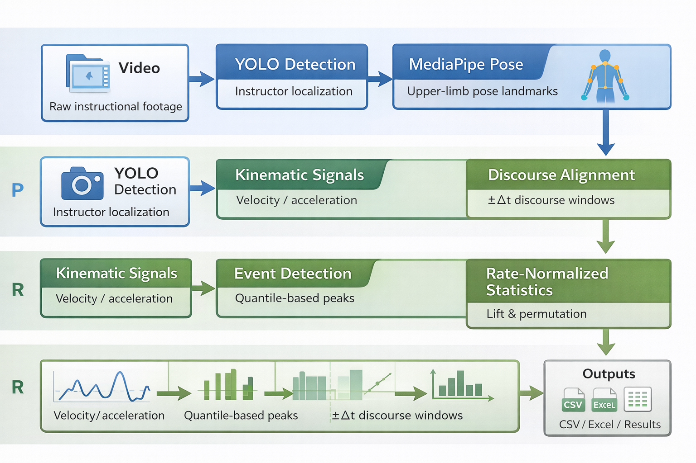

# Quantitative Gesture–Discourse Alignment Pipeline

*Multi-Modal Kinematic Alignment Pipeline (MKAP)*

---

## Overview

This repository hosts an end-to-end computational framework for quantifying the **temporal alignment between manual kinematics and discourse-structural organization** in naturalistic instructional settings.

By integrating **computer vision** with **signal processing**, MKAP shifts analysis away from categorical gesture labeling toward the **objective measurement of rhythmic behavioral enrichment** around discourse-structural nodes.
## Pipeline Overview

---

## Core Capabilities

### Computer Vision Front-End
Automated instructor localization via YOLO-based person detection, followed by high-fidelity extraction of upper-limb pose landmarks (shoulder, elbow, wrist) using the MediaPipe framework.

### Kinematic Signal Synthesis
Transformation of raw positional trajectories into continuous velocity and acceleration signals, remaining agnostic to communicative intent to preserve methodological objectivity.

### Stochastic Event Detection
Identification of salient gesture events through quantile-based thresholding and temporal clustering of kinematic peaks.

### Rate-Normalized Alignment
Statistical estimation of gesture density enrichment near discourse-structural boundaries using lift statistics and permutation-based baselines.

### Analytic Orchestration
A bifurcated R / Python architecture (via `reticulate`) that produces serialized data tables and diagnostic workbooks for downstream statistical modeling.

## Data Governance & Privacy

### Zero-Data Policy
This repository contains only algorithmic code.  
No video assets, identifiable human subject data, or copyrighted instructional materials are included.

### Local Execution
All processing is performed on user-provided local datasets.  
No data are transmitted to external servers.

### Schema Consistency
The pipeline interfaces with standardized annotation formats (e.g., CSV or ELAN-style discourse markers) while remaining agnostic to annotation semantics.

## Reproducibility & Portability

MKAP is designed in accordance with Open Science principles.

### Configurable Environments
Execution parameters, file paths, and detection thresholds are externalized via user-specific configuration or environment variables.

### Deterministic Logic
Given identical kinematic inputs and hyper-parameters (e.g., quantile thresholds, window sizes), the pipeline yields reproducible, deterministic outputs.

An empty Excel template defining alignment structure and formulas is provided in `templates/`.  
No data or annotations are embedded.

## Dependencies

### Python
- Python 3.9+
- `ultralytics` (YOLOv8)
- `mediapipe`
- `opencv-python`
- `numpy`
- `pandas`

### R
- R 4.2+
- `tidyverse`
- `openxlsx`
- `reticulate`

The pipeline uses YOLOv8 for person detection.  
Pretrained weights (e.g., `yolov8n.pt`) are automatically downloaded by the Ultralytics package at runtime and are not included in this repository.

## Installation

This repository is intended for research use rather than turnkey deployment.

1. Install Python and required packages (e.g., via `pip` or `conda`)
2. Install R and required packages
3. Configure environment variables or local paths for user-provided datasets
4. Execute scripts sequentially following the pipeline order documented in `scripts/`

## Architecture

### Unified R–Python Architecture

The pipeline utilizes a unified R–Python architecture via `reticulate`.  
By bridging YOLOv8 and MediaPipe directly into the R environment, the framework enables in-memory data transfer, ensuring a seamless flow from raw video to statistical modeling without the overhead of intermediate files.

## Ethics & Compliance

Users are responsible for ensuring that application of this pipeline complies with institutional IRB protocols, GDPR / FERPA regulations, and informed-consent requirements governing the source footage.

## Citation

If you use this pipeline in academic work, please cite it as a methods-companion codebase:

**Liu, G. (2024).**  
*Multi-Modal Kinematic Alignment Pipeline: A Computational Framework for Instructional Discourse.*  
GitHub repository.
